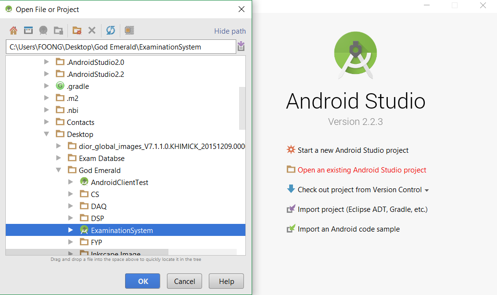
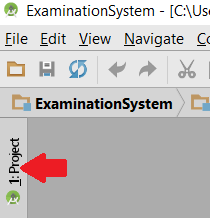
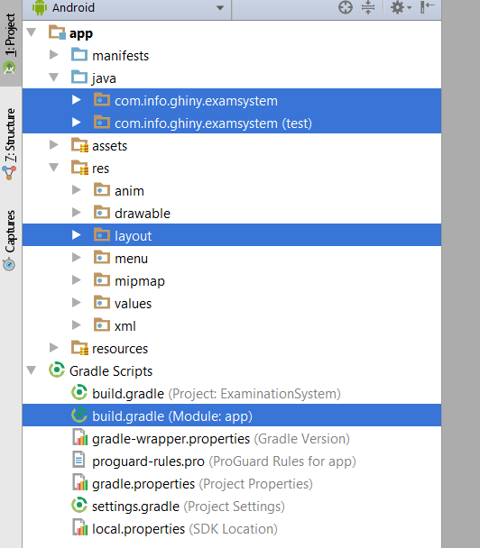
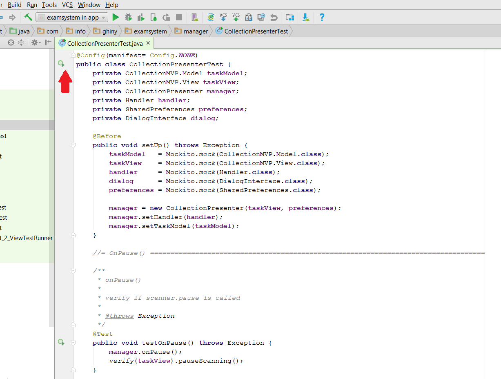
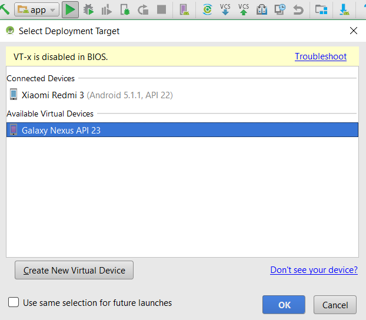

# ExaminationSystem
Description
===============
An Android based Exam Attendance System that utilize QR code for data interaction.
Scan QR code to take attendance of candidate & staff.
Using ZXing QR scan library to decode QR code and query database through socket network.


Software Requirements
========
- **Java**
  - *Download Java JDK at http://www.oracle.com/technetwork/java/javase/downloads/jdk8-downloads-2133151.html*
  - *Install Java*
  - *Set Environment Variable for JAVA_HOME to the path where the JDK was downloaded.*
  - Example:
    ````
    C:\Program Files\Java\jdk1.8.0_111
    ````
- **Git**
  - *Download Git at https://git-scm.com/downloads*
  - *Install Git Bash*
- **Gradle**
  - *Download Gradle's Complete Distribution at https://gradle.org/gradle-download/*
  - *Set Environment Variable for GRADLE_HOME to the path where Gradle was saved.*
  - Example:
    ````
    C:\gradle-3.1-all\gradle-3.1
    ````
- **Android Studio**
  - *Download Android Studio at https://developer.android.com/studio/index.html*
  - *Install Android Studio*
- **SQLiteBrowser**
  - *Download SQLiteBrowser at http://sqlitebrowser.org/*
  - *Install SQLite Browser*
- **NetBean**
  - *Download NetBean IDE at https://netbeans.org/downloads/*
  - *Install NetBean*


Project Development:
==================
Clone Project into Computer
------
Open GitBash (like cmd) and type: 
````
git clone https://github.com/EmeraldWolfram/ExaminationSystem
````
to clone the project into the computer.
Development
-----
- Open Android Studio -> Open an existing Android Studio project -> browse the project cloned (ExaminationSystem)

- Wait for project initialization. *(Slow if the computer have small RAM)*
- Project can be developed in all the folder in this list

- Important Starting Point were highlighted in blue
  - 1st highlighted folder store JAVA program
  - 2nd highlighted folder store TEST code
  - 3rd highlighted folder store USER INTERFACE layout
  - 4th highlighted folder allow dependency and library inclusion


Testing
-----
- To run automated Test, press the circular green button as shown below:

- To run on PC Simulator, select 'app' and press 'RUN' on the targeted virtual device as shown below:

- To run on a real Android Phone
  - Flash through USB cable
    - Enable Developer Mode in Android phone by pressing Build Number under Setting for 7 times.
    - In Android Studio, select 'app' & press 'RUN' on the connected Phone via USB cable
    **NOTE that you could brick your phone if you disconnect your phone while flashing**
  - Generate APK and install
    - Generate APK as shown below
    [APK Generation](screenshot/BuildingAPK.png)
    - The APK will be generated in app/build/outputs/apk/app-debug.apk
    - Suggestion: Upload to Google Drive, download and install
    - If you FAIL to install the APK, uninstall the existing application and retry.
    
Presentation
-----
Vysor, a good Google Chrome application for Android project presentation.
- Install Google Chrome and search for Vysor
- Install Vysor as a extension for Google Chrome

QR Generator
-----------
Generate QR code at https://www.the-qrcode-generator.com/
- This website is user-friendly compared to others website
- It is FOC

QR code can also be generated in the application using method encodeQr() in DistributionModel.java


